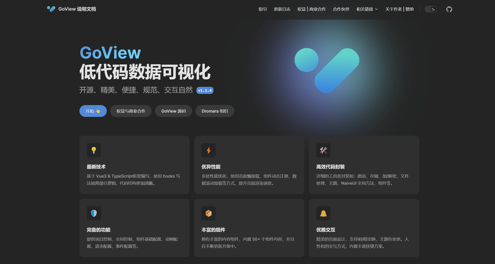
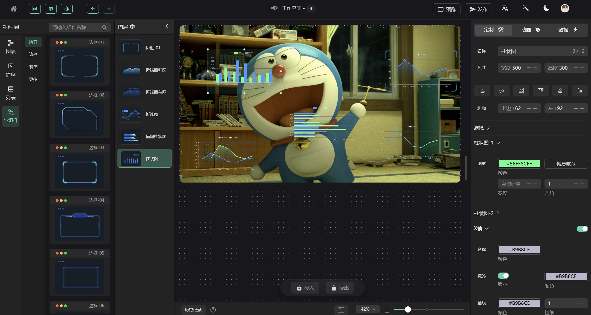
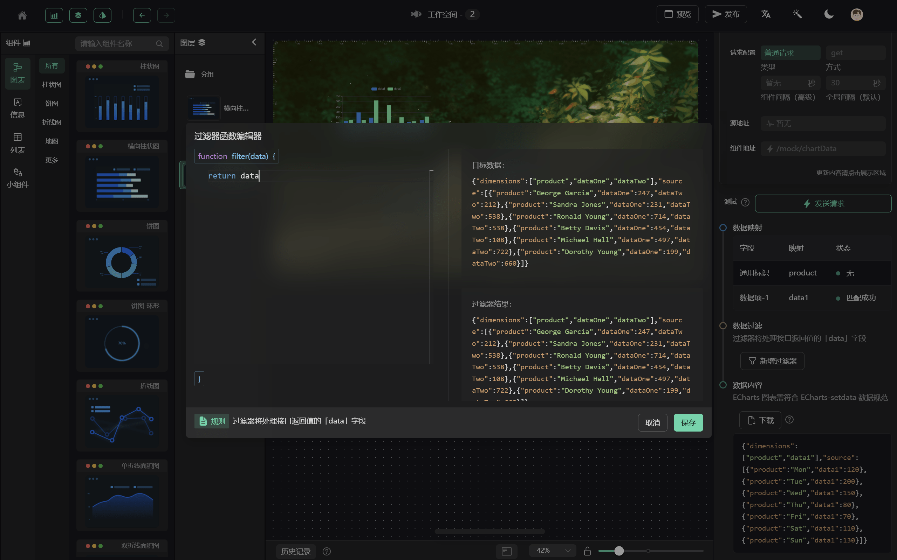
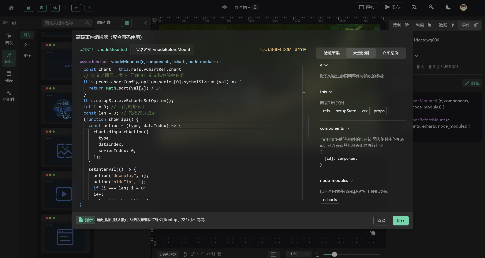
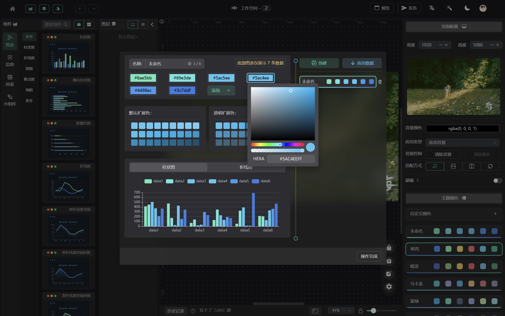
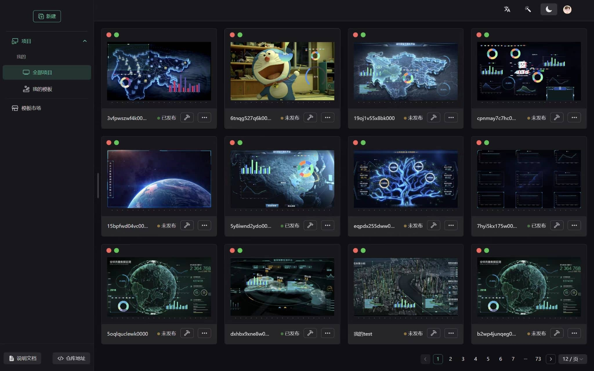
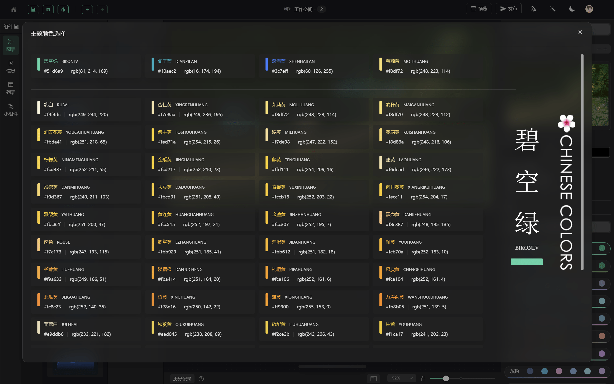
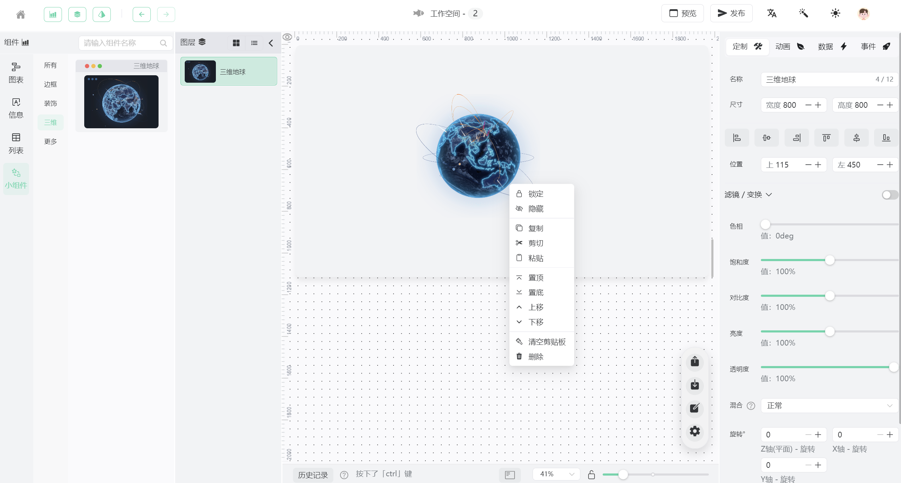
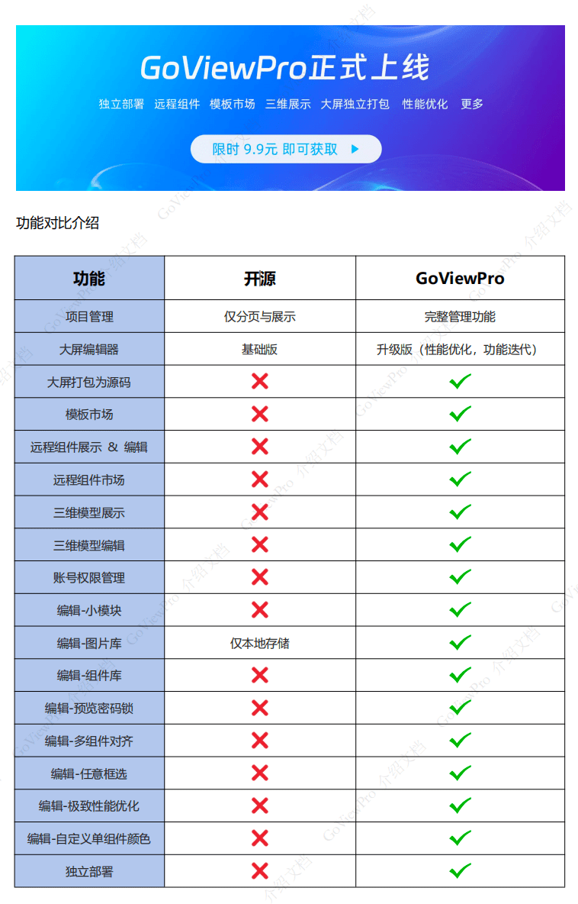

  

    

<h4 align="center">开源、精美、便捷的「数据可视化」低代码开发平台</h4>

#### 长期赞助商

  

    
     &nbsp;
    
     
     
    
     &nbsp;
      
     
     
      
    
     
     
    
    
  

#### 😶 **纯前端** 分支： **`master`**

#### 👻 携带 **后端** 请求分支: **`master-fetch`**

#### 📚 GoView **文档** 地址：[https://www.mtruning.club/](https://www.mtruning.club/)

项目纯前端-Demo 地址：[https://vue.mtruning.club/](https://vue.mtruning.club/)

项目带后端-Demo 地址：[https://demo.mtruning.club/](https://demo.mtruning.club/)

Cloud IDE 代码在线预览地址：[https://idegitee.com/dromara/go-view](https://idegitee.com/dromara/go-view)

#### 🤯 后端项目看这里!

后端地址（社区实现，仅供参考）：

- `JAVA` [https://gitee.com/MTrun/go-view-serve](https://gitee.com/MTrun/go-view-serve) (当前使用)
- `.NET` [https://gitee.com/sun_xiang_yu/go-view-dotnet](https://gitee.com/sun_xiang_yu/go-view-dotnet)
- `NODE` [https://gitee.com/qwdingyu/led](https://gitee.com/qwdingyu/led)
- `Docker 镜像` [https://gitee.com/AHEAD4/go-view-docker](https://gitee.com/AHEAD4/go-view-docker)
- `接口文档`[https://docs.apipost.cn](https://docs.apipost.cn/preview/5aa85d10a59d66ce/ddb813732007ad2b?target_id=84dbc5b0-158f-4bcb-8f74-793ac604ada3) (不是最新, 以前端代码为准)

#### 整体介绍

- 框架：基于 `Vue3` 框架编写，使用 `hooks` 写法抽离部分逻辑，使代码结构更加清晰；

- 类型：使用 `TypeScript` 进行类型约束，减少未知错误发生概率，可以大胆修改逻辑内容；

- 性能：多处性能优化，使用页面懒加载、组件动态注册、数据滚动加载等方式，提升页面渲染速度；

- 存储：拥有本地记忆，部分配置项采用 `storage` 存储本地，提升使用体验；

- 封装：项目进行了详细的工具类封装如：路由、存储、加/解密、文件处理、主题、NaiveUI 全局方法、组件等

- 入选 NaiveUI 社区精选资源推荐：[查看 NaiveUI 推荐列表](https://www.naiveui.com/zh-CN/light/docs/community)

说明文档：

工作台：

请求配置：

数据过滤：

高级事件编辑:

自定义组件颜色:

快捷主页：

主题色：

亮白主题：

主要技术栈为：

| 名称                | 版本  | 名称        | 版本   |
| ------------------- | ----- | ----------- | ------ |
| Vue                 | 3.2.x | TypeScript4 | 4.6.x  |
| Vite                | 4.2.x | NaiveUI     | 2.34.x |
| ECharts             | 5.3.x | Pinia       | 2.0.x  |
| 详见 `package.json` | 😁    | 🥰          | 🤗     |

开发环境:

| 名称 | 版本    | 名称    | 版本  |
| ---- | ------- | ------- | ----- |
| node | 16.16.x | npm     | 8.5.x |
| pnpm | 7.1.x   | windows | 11    |

已完成图表：

| 分类   | 名称             | 名称       | 名称           | 名称                     |
| ------ | ---------------- | ---------- | -------------- | ------------------------ |
| 图表   | 柱状图           | 横向柱状图 | 折线图         | 单/多 折线面积图(渐变色) |
| \*     | 饼图             | 环形图     | 水球图         | 雷达图                   |
| \*     | NaiveUI 多种进度 | 散点图     | 对数回归散点图 | 热力图                   |
| \*     | 漏斗图           | 中国地图   | 高德地图       | 🦊                       |
| 信息   | 文字             | 渐变文字   | 词云           | 嵌套网页                 |
| \*     | 图片             | 视频       | 😺             | 🐯                       |
| 列表   | 滚动排名列表     | 滚动表格   | 🐮             | 🐐                       |
| 小组件 | 边框-01~13       | 装饰-01~05 | 数字翻牌       | 通用时间                 |
| \*     | 数字计数         | 倒计时     | 时钟           | 🦁                       |

## 浏览器支持

开发和测试平台均在 `Google` 和最新版 `EDGE` 上完成，暂未测试 `IE11` 等其它浏览器，如有需求请自行测试与兼容。

## 安装

请查看文档：[https://www.mtruning.club/](https://www.mtruning.club/)

## 代码提交

- feat: 新功能
- fix: 修复 Bug
- docs: 文档修改
- perf: 性能优化
- revert: 版本回退
- ci: CICD 集成相关
- test: 添加测试代码
- refactor: 代码重构
- build: 影响项目构建或依赖修改
- style: 不影响程序逻辑的代码修改
- chore: 不属于以上类型的其他类型(日常事务)

## 交流群

QQ 群：647239611

## Pro 部分功能展示

体验地址： <a href="https://ai.goviewlink.com/" target="_blank">https://ai.goviewlink.com/</a>

